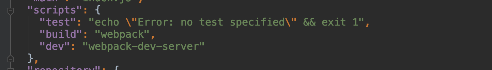
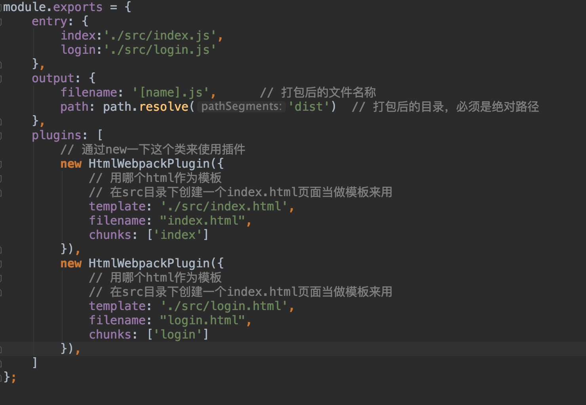
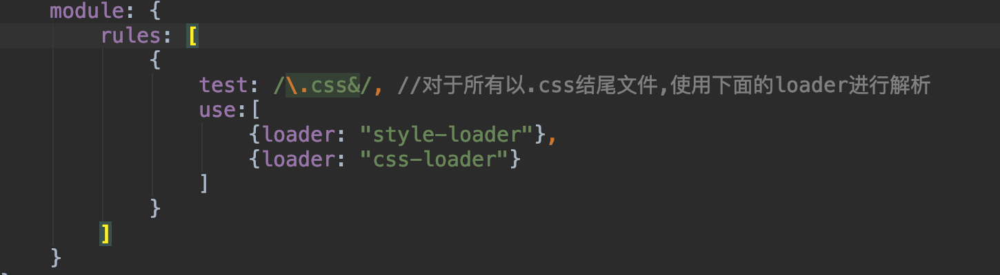
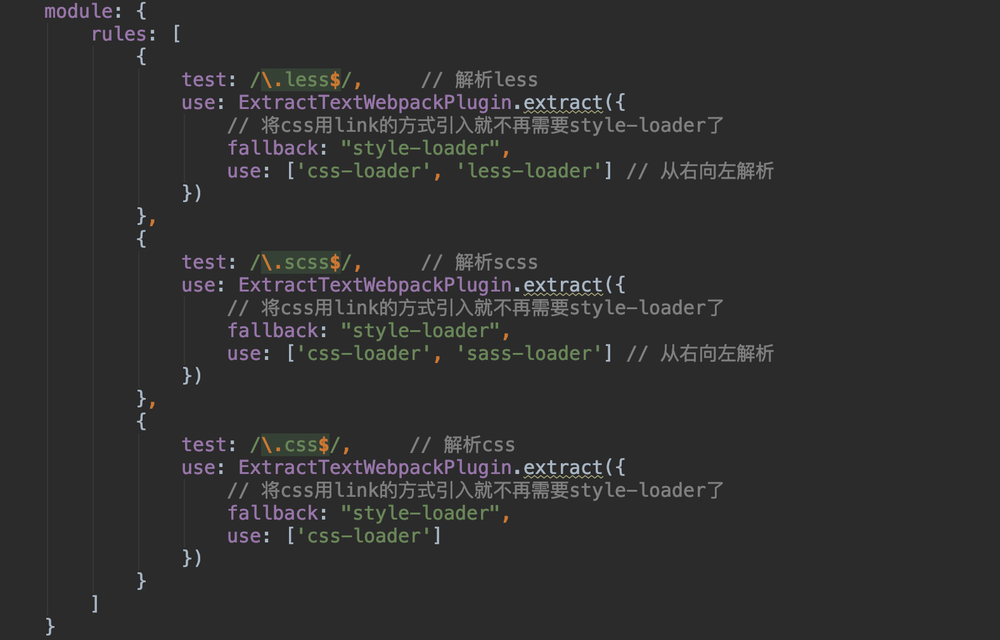

#基于webpack构建react项目
**安装webpack**

`// webpack4中除了正常安装webpack之外，需要再单独安一个webpack-cli
   yarn add webpack webpack-cli -D`
   
**webpack是基于Node的**

在项目下创建一个webpack.config.js(默认，可修改)文件来配置webpack

     module.exports = {
        entry: '',               // 入口文件
        output: {},              // 出口文件
        module: {},              // 处理对应模块
        plugins: [],             // 对应的插件
        devServer: {},           // 开发服务器配置
        mode: 'development'      // 模式配置
     }

以上就是webpack的正常配置模块
启动devServer需要安装一下webpack-dev-server

`yarn add webpack-dev-server -D`

接下来我们按照项目的结构，我们就从0开始去写一下配置

    
     // webpack.config.js
     
     const path = require('path');
     
     module.exports = {
         entry: './src/index.js',    // 入口文件
         output: {
             filename: 'bundle.js',      // 打包后的文件名称
             path: path.resolve('dist')  // 打包后的目录，必须是绝对路径
         }
     }

配置执行文件
工作当中我们打包编译的时候一般都执行yarn run dev这样的命令，既然是通过yarn执行的命令，我们就应该找到package.json里的执行脚本去配置一下命令，这里如下图所示

多文件配置

依些类推其他文件

上面基本介绍完了html和js的打包配置了，webpack对css的解析需要用到loader，所以我们先提前安装好，待会好方便使用

     yarn add style-loader css-loader -D
     // 引入less文件的话，也需要安装对应的loader
     yarn add less less-loader -D
     yarn add node-sass sass-loader -D
     
     
     
     

此时打包后的css文件是以行内样式style的标签写进打包后的html页面中，如果样式很多的话，我们更希望直接用link的方式引入进去，这时候需要把css拆分出来
extract-text-webpack-plugin插件它的功效就在于会将打包到js里的css文件进行一个拆分,单独提取css

**拆分CSS**

`yarn add extract-text-webpack-plugin@next -D`

另一个插件mini-css-extract-plugin也是可以办到的，它可以说是为webpack4而生的，
在这里就简单的提一下

`yarn add mini-css-extract-plugin -D`

     let MiniCssExtractPlugin = require('mini-css-extract-plugin');
     
     module.exports = {
         module: {
             rules: [
                 {
                     test: /\.css$/,
                     use: [MiniCssExtractPlugin.loader, 'css-loader']
                 }
             ]
         },
         plugins: [
             new MiniCssExtractPlugin({
                 filename: 'css/a.css'   // 指定打包后的css
             })
         ]
     }
